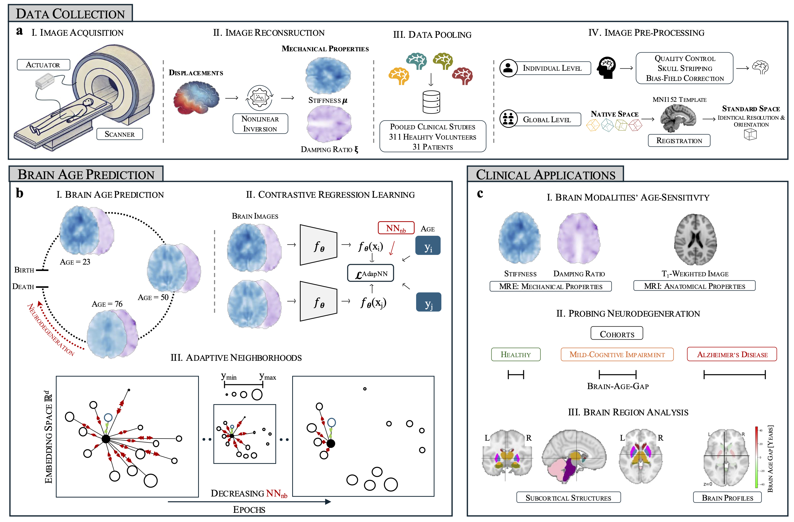

# Enhancing Brain Age Prediction and Neurodegeneration Detection with Contrastive Learning on Regional Biomechanical Properties

The aging process affects brain structure and function, and Magnetic Resonance Elastography (MRE) offers a new, unique perspective by mapping the brain’s biomechanical properties—stiffness and damping ratio—that correlate with age and disease. Using a self-supervised contrastive regression framework, we demonstrate that MRE surpasses conventional structural magnetic resonance imaging (MRI) in sensitivity to age-related changes and neurodegeneration. Specifically, stiffness captures Alzheimer’s disease (AD), while damping ratio detects subtle changes associated with mild cognitive impairment (MCI). Our regional analysis identifies deep brain structures, particularly the caudate and thalamus, as key biomarkers of aging. The greater age sensitivity of MRE translates to superior differentiation of AD and MCI from healthy individuals, pinpointing regions where significant biomechanical alterations occur, notably the thalamus in AD and hippocampus in MCI. Furthermore, our results reveal biomechanical alterations in cognitively healthy individuals whose aging profiles closely resemble patients with MCI and AD. These findings highlight MRE’s potential as a biomarker for early neurodegenerative changes, aiding dementia risk detection and early intervention.

## Dependencies

python=3.9

numpy=1.23.5

pandas=2.2.3

scikit-learn=1.2.0

scipy=1.10.0

torch=2.4.1

torchvision=0.12.0+cu113

wandb=0.16.1
